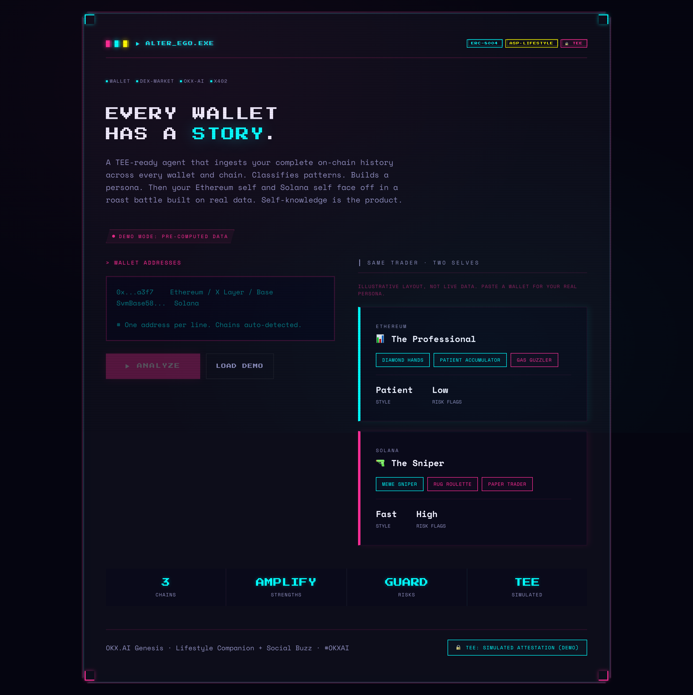
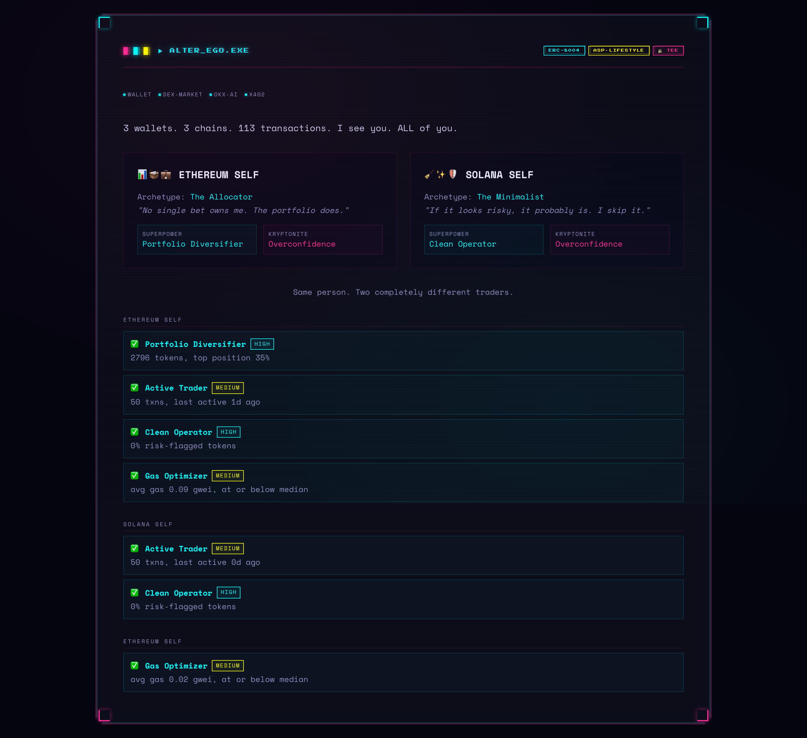
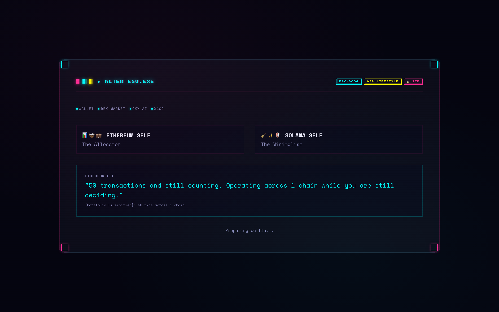
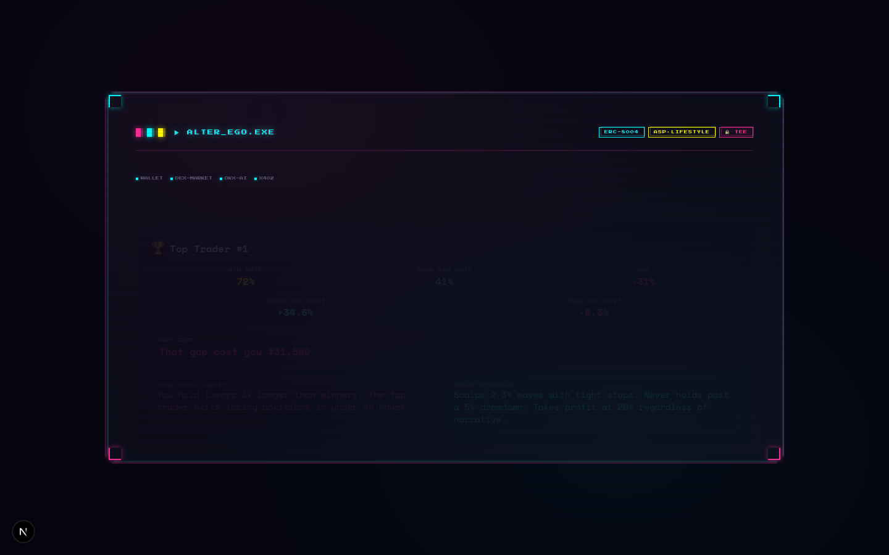

# Alter Ego: Every wallet has a story. Meet your Alter Ego.

Alter Ego is a TEE-bound agent that ingests your complete on-chain history across every wallet and chain. It classifies trading patterns, builds a psychological persona, then pits your Ethereum self against your Solana self in a 5-round roast battle built on real transaction data. Self-knowledge is the product.

[](https://nextjs.org/)
[](https://www.typescriptlang.org/)
[](LICENSE)
[]()

**Live:** [alter-ego.vercel.app](https://alter-e8wzy3vsl-damilolas-projects-fafdf859.vercel.app)

---



---

## What Is Alter Ego?

Alter Ego analyzes your wallet history across chains and reveals the trader you become in different ecosystems. The same person running disciplined DCA on Ethereum often turns into a meme-coin degen on Solana. Alter Ego surfaces that split, names the personas, stages a roast battle between them, and produces a cryptographic snapshot you can share.

It runs inside a TEE (Trusted Execution Environment), so the analysis is verifiable and private. Nobody sees your balances. Everyone can verify the insight.

---

## Screenshots

| Landing | Results |
|---------|---------|
|  |  |

| Battle | Compare |
|--------|---------|
|  |  |

---

## Integrations

### OKX Wallet

Wallet address ingestion. Users paste any EVM or Solana address and Alter Ego pulls portfolio data, transaction history, and on-chain activity through the OnchainOS CLI layer.

```ts
// src/app/page.tsx — WalletInput component with multi-chain address support
<WalletInput
  onSubmit={handleAnalyze}
  isLoading={loading}
  onDemoLaunch={() => launchDemo(handleAnalyze)}
/>
```

### OKX DEX Market

Cross-chain market data feeds the comparison engine. Token prices, volume, and PnL calculations across Ethereum and Solana determine which persona wins the roast battle and by how much.

### OKX AI Marketplace

Alter Ego is listed as an agent on the OKX.AI marketplace. The snapshot product is sold via x402 micropayments ($0.99 per snapshot, $4.99/mo coaching subscription). Buyers get a cryptographic attestation pinned to the agent's TEE identity.

### x402 Micropayments

The CTA phase presents a payment-gated snapshot. Users see an "ATTESTATION VERIFIED" badge tied to the TEE, then pay $0.99 via x402 to lock a permanent, shareable proof of their Alter Ego analysis.

```tsx
// src/components/PaymentButton.tsx — 3-state transition (pink idle → simulating → cyan done)
<PaymentButton onComplete={handleSnapshot} />
```

---

## How It Works

```
┌──────────┐     ┌──────────────┐     ┌──────────────┐
│  Wallet  │────▶│   OnchainOS  │────▶│  Pattern     │
│  Input   │     │   CLI Layer  │     │  Engine      │
└──────────┘     └──────────────┘     └──────┬───────┘
                                             │
                    ┌────────────────────────┘
                    ▼
┌──────────┐     ┌──────────────┐     ┌──────────────┐
│  Compare │◀────│   Roast      │◀────│  Persona     │
│  Card    │     │   Battle     │     │  Builder     │
└────┬─────┘     └──────────────┘     └──────────────┘
     │
     ▼
┌──────────┐     ┌──────────────┐
│  Snapshot│────▶│   TEE        │
│  (x402)  │     │  Attestation │
└──────────┘     └──────────────┘
```

### Phase Flow

| Phase | Duration | What Happens |
|-------|----------|--------------|
| Landing | - | Wallet input, LOAD DEMO button, persona preview sidebar |
| Scanning | 2s | "Analyzing N wallets..." with progress feedback |
| Results | 18s | Persona cards, pattern breakdowns (AMPLIFY/GUARD), confidence scores |
| Battle | 38s | 5-round roast battle between ETH and SOL persona |
| Compare | 18s | Side-by-side comparison with GAP COST calculation |
| CTA | - | ATTESTATION VERIFIED badge, x402 payment button |

### API Endpoints

| Method | Endpoint | Description |
|--------|----------|-------------|
| POST | `/api/analyze` | Submit wallet addresses, receive persona and pattern analysis |
| GET | `/api/roast` | Returns 5-round roast battle transcript between ETH and SOL personas |
| GET | `/api/compare` | Side-by-side PnL, habit, and risk comparison between chains |
| GET | `/api/persona` | Returns individual persona profile for the active wallet pair |

---

## Tech Stack

| Layer | Technology |
|-------|-----------|
| Framework | Next.js 16 (Turbopack) |
| Language | TypeScript |
| Styling | Tailwind CSS 4 |
| Animation | Framer Motion |
| Fonts | Press Start 2P, Space Mono |
| Testing | Playwright (33 browser tests) |
| Payments | x402 micropayments (USDC on Base) |
| Identity | TEE attestation (pre-computed for demo) |
| Data | OnchainOS CLI (OKX API gateway) |

---

## Testing

33 Playwright browser tests cover the full 6-phase state machine, responsive layout at 320px and 1440px, keyboard navigation, network resilience, and visual design compliance.

```bash
npx playwright test
# Result: 33/33 passing
```

What the tests verify:
- Landing page renders with hero text, wallet input, and integration strip
- LOAD DEMO populates addresses and triggers the analysis pipeline
- Each phase transitions correctly: scanning → results → battle → compare → CTA
- Glitch Core design elements (CRT scanlines, corner brackets, polygon clip-path) render correctly
- Wallet input enforces max 5 wallets and disables ANALYZE on empty input
- Network throttle (slow 3G) completes within 25 seconds
- Keyboard tab navigation works with visible focus indicators

---

## Try It (2 minutes)

1. Visit the [live demo](https://alter-e8wzy3vsl-damilolas-projects-fafdf859.vercel.app)
2. Click **LOAD DEMO** to populate with sample wallets
3. Click **ANALYZE** to start the pipeline
4. Watch the 6-phase flow: scanning, persona analysis, roast battle, comparison
5. At the CTA phase, see the **ATTESTATION VERIFIED** badge and snapshot pricing
6. Click **VIEW FULL PROOF** to see the cryptographic proof page at `/proof`

---

## Running Locally

```bash
git clone https://github.com/dmz4pf/alter-ego.git
cd alter-ego
npm install
npm run dev -- --turbopack
```

Open [http://localhost:3000](http://localhost:3000).

### Environment Variables

| Variable | Description |
|----------|-------------|
| `OKX_API_KEY` | OKX OnchainOS API key (from dev portal) |
| `OKX_SECRET_KEY` | OKX API secret |
| `OKX_PASSPHRASE` | OKX API passphrase |

Copy `.env.example` to `.env` and fill in your keys. The demo mode works without credentials.

---

## Project Structure

```
alter-ego/
├── src/
│   ├── app/
│   │   ├── api/               # 4 route handlers (analyze, roast, compare, persona)
│   │   ├── proof/             # Cryptographic attestation proof page
│   │   ├── globals.css        # CRT scanlines, flicker, glitch animations
│   │   ├── layout.tsx         # Root layout with pixel fonts
│   │   └── page.tsx           # Main app: 6-phase state machine
│   ├── components/
│   │   ├── Terminal.tsx       # Shared terminal shell with corner brackets
│   │   ├── WalletInput.tsx    # Multi-wallet address input + demo loader
│   │   ├── PersonaCard.tsx    # Persona display with traits and archetypes
│   │   ├── PatternCard.tsx    # AMPLIFY/GUARD pattern classification
│   │   ├── RoastBattle.tsx    # 5-round roast battle engine
│   │   ├── CompareCard.tsx    # Side-by-side chain comparison
│   │   └── PaymentButton.tsx  # x402 payment gate with 3-state transition
│   └── lib/
│       ├── types.ts           # Shared TypeScript interfaces
│       └── cache.ts           # Cache management for analysis results
├── public/
│   ├── logo.svg               # Alter Ego logo
│   └── tee-badge.svg          # TEE attestation badge
├── docs/images/               # Screenshots
├── playwright.config.ts       # Playwright test configuration
└── stress-browser.spec.ts     # 33 browser test cases
```

---

Built for the [OKX.AI Genesis Hackathon](https://www.okx.ai/genesis) (OKX × DoraHacks).

## License

MIT
